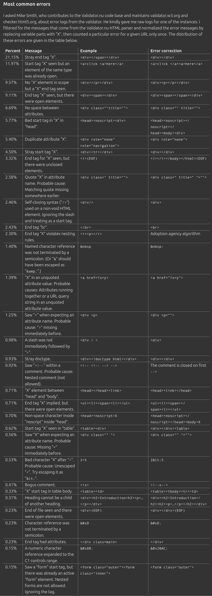

## Astro

### Asset shortcut plugin

-   Make referencing asset folder easier. Currently to access the images, you have to use `../../assets`. But we can use `~` to reference `assets` by default.
-   This is also true, when using `baseUrl`. As all the relative links have to add `baseUrl`.

## Starlight

### Docusaurus clone

-   There are a tone of features in Docusaurus (and other static site generators) that are missing in Starlight.
-   Clone starlight and create a new theme, with all these features included.

### Sidebar utils plugin

**Motivation** \
Show "Internal" in the sidebar only for the _internal_ subroute. Also, create a table of contents like page for "kushajveersingh.com/internal" which has the same content as the "internal" in the sidebar. This has the benefit

-   people don't have to create the page manually.
-   people can go directly to "internal" and look for what they want, rather than going to "internal/something".

Other stuff

-   Add option to collapse sidebar like Docusaurus and look for other features provided by Docusaurus sidebar.
-   Look at other Starlight plugins related to sidebar.

## Prettier

### Plugin markdown codeblocks

-   Create a Prettier plugin, that disables formatting of codeblocks in Markdown.
-   Also, see if the logic can be extended to format the codeblock based upon the language used by the codeblock. And provide an option which can be provided in the backticks to disable formatting manually.
-   Look into Prettier markdown code, to see if various formatting options can be disabled manually.

### Configurable Formatter

**Motivation** \
Unopinionated prettier alternative. In Markdown, prettier would currently format codeblocks and that would mess up JS code. And the way to avoid this is by adding prettier ignore comments, which is annoying.

Split the project into core module and language specific modules.

**Goal**

-   It should be drop in replacement.
-   Rewrite in C++.
-   Clear all [prettier tests](https://github.com/prettier/prettier/tree/main/tests/format) to ensure success.
-   All the 3rd party plugins/integrations should work automatically. For this you might have to force people to rename your package to "prettier" manually (or through a script, soft alias).

Other stuff

-   Make every formatting option of prettier available as a config option.
-   Prettier plugin to disable formatting of content inside codeblocks in markdown. Need to handle the case of using more than 3 backticks to specify a codeblock.
-   Additionally, code inside codeblocks should be formatted as per the provided language.
-   Disable formatting of content inside frontmatter i.e. inside `---`.
-   Publish on `npm`, `jsr`. Look for other alternatives.
-   Copy prettier repository/doc/npm structure.
-   By default, the new formatter should behave the same as prettier.
-   Provide a config file, which includes all the config options, that people can read top-to-bottom. This is one thing that I found annoying with current tools, as you have to check the docs for all possible options and sometimes they are not even documented properly.
-   C++23 is the target and the formatting should be parallelized.
-   Look at prettier alternatives like [Biome](https://biomejs.dev/) written in Rust and do speed comparisons.
-   For every possible formatting done by Prettier, expose a function letting people build their own logic on how to format that option. For example, if you have code that handle formatting ternaries, then expose a function that can override that behavior.
-   Use the Chrome JS parser to get the AST.
-   If AST is the way to fo formatting, then look into all the programming languages out there and integrate their AST into the project, and then provide an option to format each node. This would make the project a universal formatter.

## HTML

### Analyze DOM

-   There are chrome extensions that deal with analyzing DOM like number of nodes. Consolidate all the extensions into one script/extension.
-   Chrome console shows DOM after JD render. Ctrl-U shows HTML returned by the server. In the chrome DOM, spaces and newline nodes are not shows. In your project show these as well.

### Linter

-   In the spec, there are ton of recommendations, plus errors which browsers respect. And all this information can be converted to linting rules.
-   For each tag look into
    -   how many times they can appear in the DOM. Like `<title>` can only appear once and in the `<head>`.
    -   the possible attribute values, and no duplication of attributes.
-   Security best practices, should also be integrated. This includes how to get rid of all security attacks like cross-site, and more (as mentioned in the spec).
-   For SSR framework, get all the routes and then run the linter on the generated HTML. Since in SSR, all HTML is hidden in JS and linter would not be of much use.
-   Check HTML xmlns for XML, for stricter parsing.
-   `

Text

` - Linter can look into unnecessary tags as well. What is nested div's are used, but the code be replaced with just one div.
-   Ensure all the tags are closed. Every tag (should probably) have a certain number of valid tags that can be nested inside of it. This information might be helpful for guessing if the tag was closed or not. When using the HTML parser, you have to look into if the AST returned includes auto-closing nodes added by the parser, which is what we don't want. The reason why we don't want auto-closing tags, is it sometimes results in weird behavior.

    -   This website lists [most common errors](https://htmlparser.info/conformance-checkers/).

        

### Minifier

-   For each tag, use the spec to minify to the extreme.
-   Add an option to further compress the output using popular compression techniques and show the output size comparison using various all the comparison options.
-   Use DOM analyzer, to test the effectiveness of the minifier, in terms of `querySelector` performance, number of nodes, and other relevant stuff.
-   For removing optional closing tags, one situation that comes to my mind is people modifying HTML from JS. Using `.innerHTML` to access HTML, would produce HTML without closing tags in production, which would be different from development, since the closing tags would be enforced through the linter.

### Formatter

Create HTML formatter module for Configurable formatter.

### Parser library

-   Create a utility library that exposes the HTML parser that you use in previous projects, and can work on both full-HTML string and streaming HTML.
-   For the streaming HTMl, build a visualization tool to show how the DOM looks over time. The streaming should be at 1 character increment levels. And then of course you can provide a batch size option.
-   Show where the parser got halted. Like script, link, style tags halt the HTML parser. How can this information be made available to the users.

## Spellcheck program

-   When using VSCode [Code Spell Checker](https://marketplace.visualstudio.com/items?itemName=streetsidesoftware.code-spell-checker) extension, there are so many false positives.
-   Make your own spell checker, and provide utilities to add their own content.
-   For example, in case of HTML, the HTML spec contains all the valid words. So just add every word of HTML spec into the spell check dictionary, and this should include HTML specific words. You can look into creating separate dictionaries for each language.
-   An alternative, is to look into the grammar of each language and add all the keywords and stuff like that. Also, for each language there are rules like, the function name can be anything, so spell checker should not be enforced there.

## Project version and info tracker

**Motivation**\
Make it easier to track the dependency of packages used across multiple projects, thus helping with version upgrades. And the same reasoning for personal info, like the tagline I use across all social media.

Other stuff

-   For every dependency, For every dependency, show the location and version number that the dependency is used in, in tabular form. Current version, latest version, location. Set the background of the table cell based on how far the current version is from the latest version.
-   Create a C++ script that can automatically get the version number of all the dependencies used by a project. So if you have 10 projects, you provide it 10 urls/locations and 10 methods to get all the required version numbers. And then you run the script whenever you want to update the page. It also fetches the latest package version.
-   The information can be outputted in some standard format (read on which format to choose).
-   Also, add personal information tracking. Like you are using a tagline across multiple social media accounts and pages. So you list things like tagline, name and then list of all locations those things are used.
